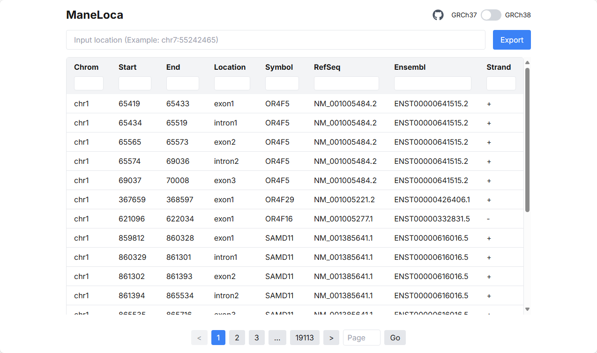

# ManeLoca

ManeLoca (MANE Locus) is a web tool that helps locate genomic coordinates within MANE Select transcripts.

Use [ManeLoca Online](https://maneloca.vercel.app/) !

## Overview

ManeLoca is a React-based web application that allows users to easily find the corresponding position in MANE Select transcripts given a genomic coordinate. MANE (Matched Annotation from NCBI and EMBL-EBI) Select transcripts represent a high-confidence set of human transcript annotations agreed upon by both NCBI and Ensembl.

## Features

- Simple and intuitive user interface
- Convert genomic coordinates to MANE transcript positions
- Support for GRCh38/GRCh37 genome assembly
- Detailed transcript information display

## Install

```bash
git clone https://github.com/pzweuj/ManeLoca.git
cd ManeLoca

# database update (option)
git clone https://github.com/pzweuj/ManeSelectBed.git
python merge_data.py

# Run
npm install
npm run dev
```

## Shot



